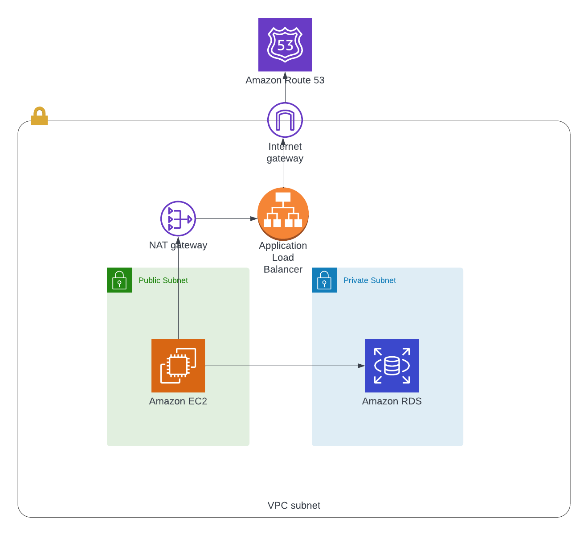

# CMS Deployment

I chose Wordpress as the CMS to deploy.

I wanted to make it secure by limiting ingress and egress to the EC2. I also split the EC2 and RDS (running MySQL) onto two different subnets with the private RDS subnet only allowing port 3306 connections, only allowing connections from the public subnet and not allowing connections from the internet.

It uses small databases and EC2 instances.

## To deploy

To initialise the terraform project and see what it will produce run:

```
terraform init && terraform plan
```

Before continuing, go to this address and accept the T&Cs: https://aws.amazon.com/marketplace/server/procurement?productId=7d426cb7-9522-4dd7-a56b-55dd8cc1c8d0

(If this is skipped, the apply will hang and timeout)

to properly deploy it, run:
```
terraform apply
```

Terraform will ask you for a 'yes' prompt if there are no issues.


## Architecture

The architecture within these terraform files is something along the lines of the following diagram



However, due to issues with the images used, there isn't a landable Wordpress page, which is discussed below.

The EC2 runs a prebuilt image from the AWS Marketplace built by Bitnami that runs Wordpress. This should be able to be configured to read from the MySQL RDS on the private subnet.

## Future

These are some ideas for the future of the project if I were to continue:

- Get the EC2 working correctly and showing at the very least an error page
- Ideally, the project would cache the frontend using CloudFront
- Pipeline to allow for upgrades of Wordpress without affecting production

## Issues Encountered

An area I had issue with was the image for the EC2 instance. I was using a Bitnami Wordpress image from the AWS marketplace however, I wasn't able to get even the SSH to work correctly.

I tried manually creating the EC2, using SSH to log in and manually install Wordpress to point to an RDS instance but the EC2 couldn't see the RDS instance. I tried (temporarily) allowing all connections to the RDS but this made no difference.

As a sanity check, I tried a lightsail instance and this worked but it's lightsail and I would've been surprised if it didn't work.
